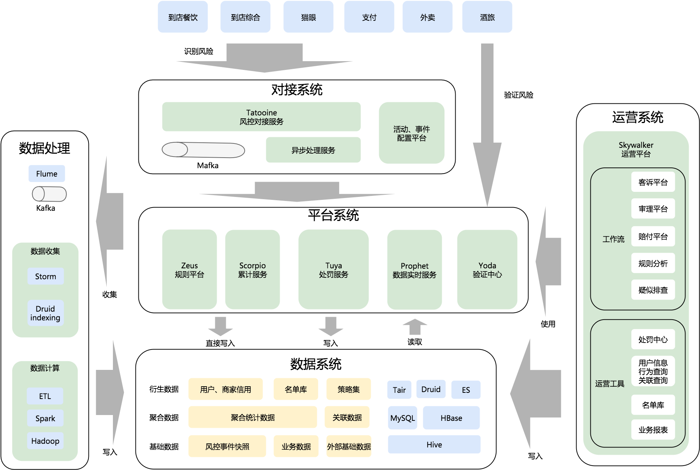

````
v1.0 update@20181202 梳理框架
v2.1 update@20190102 梳理风控相关各模块的职责
v2.2 update@20190323  20190324
 - 文档结构调整；【所谓风控】部分丰富
 - 加入美团风控架构图
 - TODO：
 	-风控接入+规则引擎 补充，技术落地方案
    -风控行业相关资料搬运到本地
v.2.3 update@20190525
    
````

# 一、所谓风控(What && Why)

所谓风控，可以拆解从2个方面看，即 `风险` `控制`

## 风险(what)

`风险`  这里狭隘的特指互联网产品中存在的风险点，例如

* 账户风险
  * 垃圾注册账号
  * 账号被泄露盗用
* 交易支付风险
  * 刷单：为提升卖家店铺人气，买卖家串通等方式虚假交易
  * 恶拍：恶意买家在卖家店铺频繁下单不支付；恶意买家通过频繁下单传播垃圾UGC等行为
  * 盗刷：买家卡被盗在平台上消费
  * 套现：伪装买卖家，在平台上信用卡交易，套出现金获利
* UGC风险
  * 风险类别：涉政、涉黄、涉爆等方面的文本、视频
  * 传播渠道：创建店铺、商品相关的标题，详情页；下单支付的备注留言；IM消息等

## 控制(why)

一般互联网产品，特别电商类产品，都希望拉新提升日活，同时运营好这些用户，提升用户粘性。类似刷单、恶拍等交易支付风险，传播垃圾信息等UGC风险会严重影响平台产品体验，所以我们需要控制这些风险点。

`控制` 即是要预防、识别、控制风险的发生。风险的控制一般分为事前，事中，事后3个阶段处理。

* 识别及预防：一般风险行为和正常行为的行为链路会有所不同。通过分析用户的整个行为链路，可以将风险行为和正常行为区分开
* 事后控制：风险事件发生后，可以采取一定措施控制事件影响，例如用户套现，交易已经发生，但是可以通过控制提现时长或者冻结资金等方式来控制减小影响面


# 二、如何风控-How

下图是美团风控架构图，自己想要总结的也和下图大同小异。这里借用，下面详细描述各模块职责和一些技术细节




## 对接系统

从产品层面看，风控会对接很多产品线，例如上图中到店餐饮、外卖等。和业务线的对接方式不断迭代有以下优化

* 原始的方式：每个业务线单独对接，都需要新开接口，单独支持联调。成本高，效率低
* 优化后方式：打造统一接入平台，业务+场景 平台化配置，自动对接调试。

对接系统只专注负责一个事情，即通过配置化对接业务的风控接入，需要配置的点，包含2个部分

* 配置业务和场景：让风控感知到新的业务场景的接入
* 数据协议：配置请求参数的数据字段
* 异步事件接入：额外的数据接入，可能是通过消息接入。例如订单状态变更的消息等

各业务线接入后，整个数据层面也可以通过账户或设备指纹等维度打通，这样就可以从用户整个行为链路分析和识别风险。


## 平台系统

### 规则引擎

规则引擎作为风控的核心，最重要的便是如何将 **规则算法** 和 **数据特征** 灵活高效组装，将他们的功效输出。

直白讲，规则引擎对每次 **事件** 的风险判定，是根据 **规则算法** 综合判定的，而规则算法一般都会需要很多特征数据。左手规则算法，后手特征数据，拼装在一块，变得出风险判定结果

规则引擎系统的打造，一些细节采用如下QA的方式表述

Q1：规则集如何获取

A1：依据风控事件的不同，从规则管理中心获取对应规则。同时规则也应有版本控制


Q2：特征数据如何获取

A2：规则集获取到后，便知道整个规则集需要的特征数据集，直接从数据中心获取


Q3：规则的依赖关系及并行执行

A3：并行；串行；树形等


TODO 更多的细节待思考和补充

Q：规则的动态化发布；规则的表达和可配置；

Q：风险事件的同步、异步接入


事件的风险判定。

数据：事件基础数据；扩展数据


几个概念

Facts：some facts

Rule：when(Condition) and then

Actions


### 规则平台

#### 规则设计

从不同层次看，规则可以分为

- 因子：最小的逻辑单元。例如 买家单日下单总量>5；注册时间3天内等
- 规则：最小的决策单元，由若干因子和与或逻辑嵌套组成。例如 买家单日下单总量>5 且 (注册时间3天内 或 买家单月支付总额>1000)
- 策略集：某个业务场景下的规则集，由若干规则组成

#### 规则维护

从B端角度看，规则中心主要负责

- 规则的增删查改的维护
- 规则的测试
- 规则效果分析

从C端角度看

- 各业务线规则集的查询

### 数据特征中心

一般针对需要风控介入的场景，称场景下的每次行为为一个事件，例如称一个新用户注册为一个注册事件，一次下单行为为交易事件，一次支付行为为支付事件等等。

上面描述的每个事件，都可称为基本`事件数据`。

特征中心主要负责维护规则和算法需要的各种特征数据。针对事件数据，可能做多种维度的统计和分析得到处理后的数据，称为 `特征数据` 。例如单个用户每小时，每天，每周的下单量等。


###处罚中心

负责各种维度的处罚记录和查询，维度包括用户，卡，设备，银行卡号等维度。处罚数据其实也可以看做一种特征数据。维护黑白灰等名单。


### 验证中心


## 运营系统

### 审核中心

针对处罚后需要用户申诉及客服审核的业务线，需要建设案例库及审核中心来支持。


# 三、风控圈子

## 行业参考

小米：https://toutiao.io/posts/c355w5/preview

饿了么：https://blog.csdn.net/gitchat/article/details/78086327

美团：美团博客上的后来被删除，估计是太敏感了。不过网上应该都能搜到。 待补充

携程：https://mp.weixin.qq.com/s/muufqznNNVidPgamlcurCQ

## 风控er

`同盾` `张新波` http://xinbo.me/

`美团` `唐义哲` http://typd.github.io/pages/about-me.ch/

`唯品会` `WalterInSH`  https://github.com/WalterInSH/risk-management-note


## 相关活动及会议

SACC 2016 互联网安全和风控体系 会议分享(京东、爱奇艺、美团等)：http://safe.it168.com/a2016/1028/3000/000003000971_all.shtml


# 四、风控相关招聘

## 技能点

架构设计

数据算法


## 面试被问到的几个问题

1.规则引擎的准确性

Q：每个规则都有一个准确率p(p<1)，当多个规则并行判定的时候，准确率就会是p1\*p2\*...\*pn，规则越多，准确率越小？ 

A：不是。多个规则并行判定准确率的乘法计算，是基于各规则独立的假设。事实上，这个独立性假设一般不满足。规则间一般都是有所关联的，例如黑白名单的过滤，规则条件的关联等。


2.规则更新

Q：一般我们的规则会经常更新，如何保证规则的实时生效

A：服务加载规则一般会缓存，这里规则有更新后，推送消息给应用，让缓存失效，重新拉取最新规则


## 招聘JD

拼多多：https://www.lagou.com/jobs/3458578.html?source=position_rec&i=position_rec-2


# 五、参考

支付宝如何识别骗子：https://www.zhihu.com/question/20669015

美团风控架构设计：https://tech.meituan.com/2017/01/13/risk-control-system-experience-sharing.html